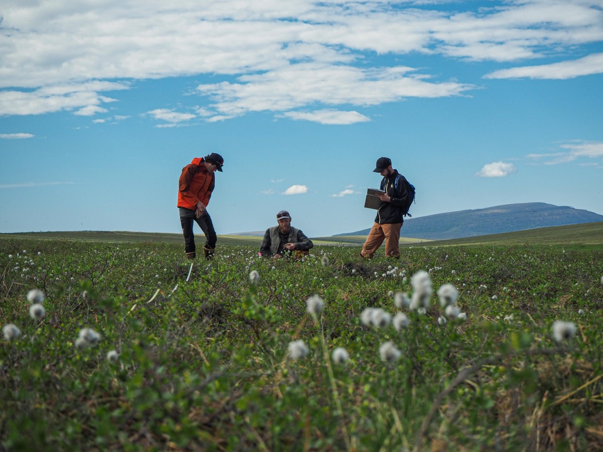

```{r setup, include=FALSE}
knitr::opts_chunk$set(echo = TRUE)
```





## Helpful tutorials:  

[Links to helpful websites](Rmd/Helpful_links.html)  

[Shareable leaflet map code](Rmd/Sharable-map-code.html) 

## Code for Thesis Data:  

[LTER 06MAT Plant Cover](Rmd/LTER_06MAT_cover_thesis.html)  
  *This code is currently the most efficient/organized if you are looking for a good example of working with data from start to finish.*

[Simulated Herbivory](Rmd/Simulated_Herbivory.html)  

[Toolik Team Vole Plant Cover](Rmd/Team_Vole_cover.html)

[EXAMPLE FOR SARA](Rmd/Sara_data_box_whisker.html)  
  *Code for Sara that we worked through on 03/04/22 to create a simple box plot.*

## Fun graphics/pictures:  

[Team vole graphics](Rmd/Team_vole_graphics.html)  

[LTER graphics](Rmd/LTER_graphics.html)  

[Summer 2021 Feild Photos](Rmd/summer_2021_feild_photos.html)

